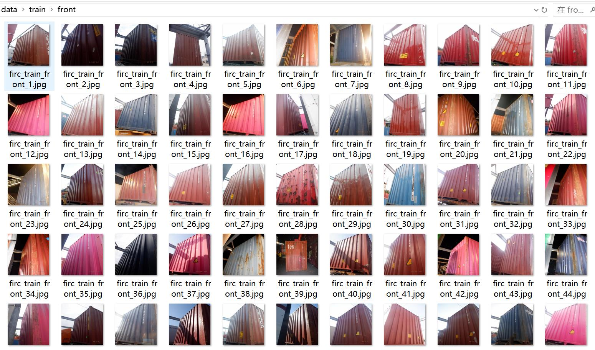
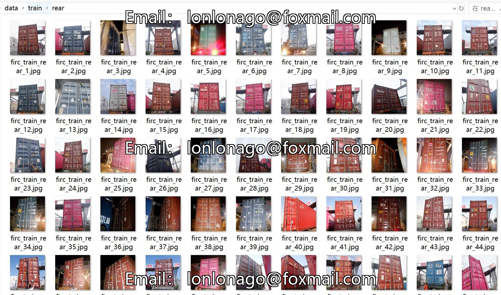
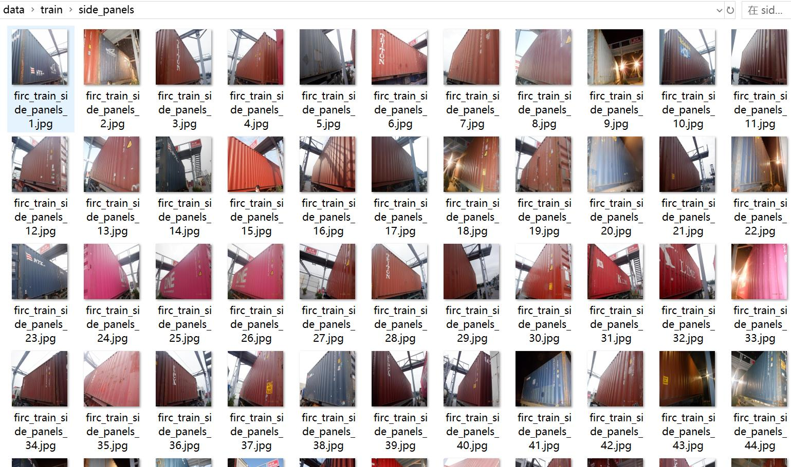

# Container Side Direction Classification Dataset 2408 Images in 5 Categories

Dataset Type: Image classification for use, not for target detection without labeled files.

Dataset Format: Only contains JPG images, each category folder contains the corresponding image.

Number of Images (JPG File Count): 2408

Number of Categories: 5

Category Names: ['front', 'front_and_side', 'rear', 'rear_and_side', 'side_panels']

Number of Images per Category:
- Training Set Images: 1922
- Front (Front) Training Set Images: 158
- Front_and_Side (Front and Side) Training Set Images: 347
- Rear (Rear) Training Set Images: 280
- Rear_and_Side (Rear and Side) Training Set Images: 594
- Side_Panels (Side) Training Set Images: 543

Validation Set Images: 245
- Front_and_Side (Front and Side) Validation Set Images: 81
- Rear (Rear) Validation Set Images: 6
- Side_Panels (Side) Validation Set Images: 158

Test Set Images: 241
- Front (Front) Test Set Images: 25
- Front_and_Side (Front and Side) Test Set Images: 51
- Rear (Rear) Test Set Images: 28
- Rear_and_Side (Rear and Side) Test Set Images: 65
- Side_Panels (Side) Test Set Images: 72

Total Images:
- Front (Front) Total Images: 183
- Front_and_Side (Front and Side) Total Images: 479
- Rear (Rear) Total Images: 314
- Rear_and_Side (Rear and Side) Total Images: 659
- Side_Panels (Side) Total Images: 773

Important Note: No guarantees are made regarding the accuracy of the trained models or weight files.

Image Preview:

## Image

Here is a pay link on Stripe ( https://buy.stripe.com/3cs8yP7sY87d0vu9AB ). Please contact me lonlonago@foxmail.com after funding $89, and I will send you a complete data files , thank you!

